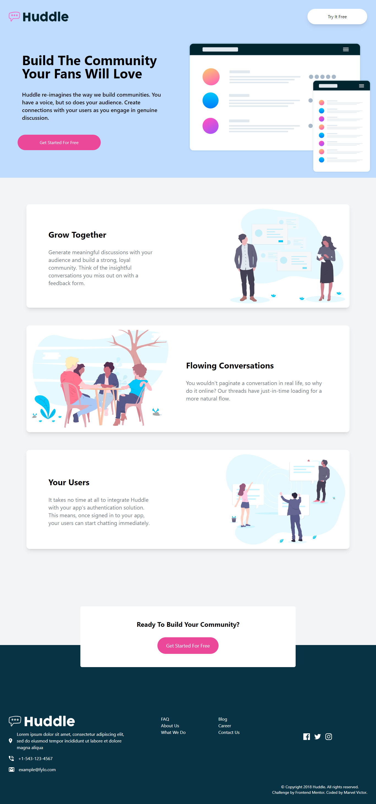
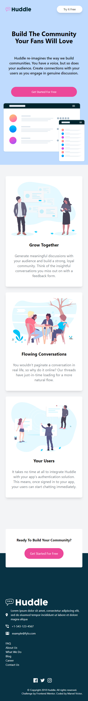

# Frontend Mentor - Huddle landing page with alternating feature blocks solution

This is a solution to the [Huddle landing page with alternating feature blocks challenge on Frontend Mentor](https://www.frontendmentor.io/challenges/huddle-landing-page-with-alternating-feature-blocks-5ca5f5981e82137ec91a5100). Frontend Mentor challenges help you improve your coding skills by building realistic projects. 

## Table of contents

- [Overview](#overview)
  - [The challenge](#the-challenge)
  - [Screenshot](#screenshot)
  - [Links](#links)
- [My process](#my-process)
  - [Built with](#built-with)
- [Author](#author)

## Overview

### The challenge

Users should be able to:

- View the optimal layout for the site depending on their device's screen size
- See hover states for all interactive elements on the page

### Screenshot

- Desktop Solution Screenshot

- Mobile Solution Screenshot

### Links

- Frontend Mentor Solution URL: [Frontend Mentor Solution Page](https://www.frontendmentor.io/solutions/)
- Live Site URL: [Live Hosted Website](https://mharvel13.github.io/Huddle-Landing-Page-With-Alternating-Feature-Blocks-Master/)
- Github Solution URL: [Github Hosted Codes](https://github.com/Mharvel13/Huddle-Landing-Page-With-Alternating-Feature-Blocks-Master)

## My process

### Built with

- Semantic HTML5 markup
- CSS custom properties
- Flexbox
- CSS Grid
- Mobile-first workflow
- [Tailwind CSS](https://tailwindcss.com/) - CSS Library

## Author

- GitHub Profile - [Mharvel13](https://github.com/Mharvel13)
- Frontend Mentor - [Marvel Victor](https://www.frontendmentor.io/profile/Mharvel13)
- Twitter - [Marvel](https://twitter.com/Mharvel_O)